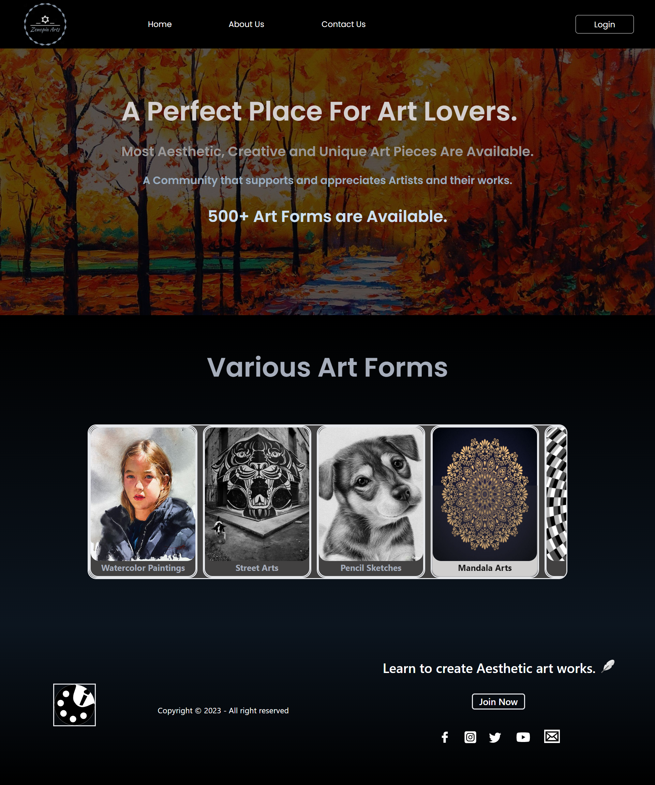
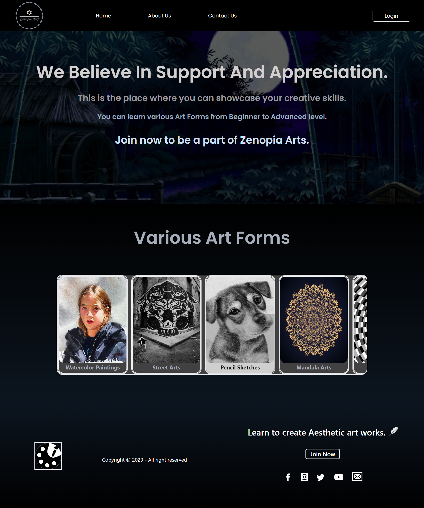
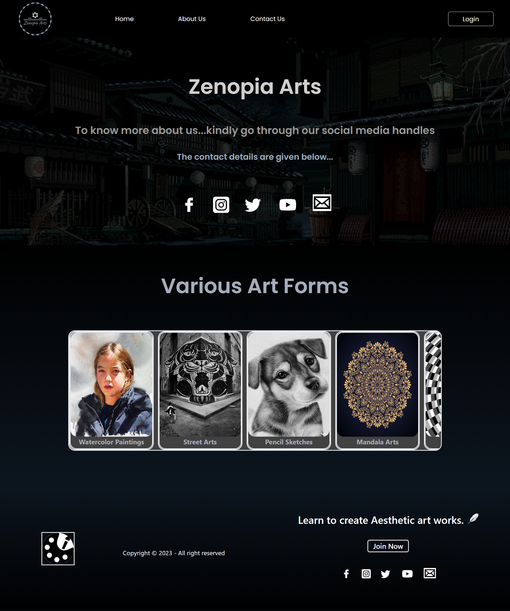

# Project Name : React Routing HomePage 

---
## React Routing 
In this project, we have learnt how Routing is provided in a react app.

We have seen two types of routing, one is simple routing and the other is nested routing.

The screenshots of the project and the link of the project is provided below. 

## Project Screenshot

> 
> 
> 

---

## You can Check it Live on Below Link :

> 

---